<div align="center">

# KSEC™
### Sovereign Kernel Substrate for Autonomous AI & Parallel Agent Runtimes

[](https://ksec.space)
[](https://ksec.space)
[](https://ksec.space)
[](https://ksec.space)

<p align="center">
  <b>Eliminate TOCTOU race conditions and unverified socket exfiltration at Ring-0.</b><br>
  Deterministic, hardware-enforced syscall interceptor engineered for production agent swarms.
</p>

[Enterprise Documentation](https://ksec.space) • [Architecture Whitepaper](https://ksec.space/whitepaper) • [Security Manifest](https://ksec.space) • [Contact Sovereign Sales](https://ksec.space)

</div>

---

### Executive Overview

As enterprise deployments shift from stateless conversational LLMs to stateful, autonomous execution swarms (FastMCP, LangGraph, AutoGen), traditional application-layer guardrails fail to mitigate critical attack vectors. Semantic evaluators and regex interceptors introduce prohibitive latency penalties (500ms–2,500ms) and remain fundamentally susceptible to Time-of-Check to Time-of-Use (TOCTOU) exploitation, token obfuscation, and raw socket data exfiltration.

**KSEC** relocates defense boundary verification from user-space down to the **Linux eBPF LSM & XDP kernel substrate**. By coupling sub-35μs cryptographic intent-lease verification with in-kernel packet inspection, KSEC provides mathematical finality against sandbox escapes before execution passes the `libc` boundary.

---

### Production Topology

```text
               +-------------------------------------------------------------+
               |            Enterprise AI Swarm / LLM Orchestrator           |
               |            (Claude FastMCP, LangGraph, Multi-Agent Mesh)    |
               +-------------------------------------------------------------+
                                              |
                              [ Cryptographic Intent Lease ]
                                              v
+================================ USER SPACE ============================================+
|  KSEC FastMCP Daemon (Zero-Copy Shared Ring Buffer / Memory Lock Verification)          |
+========================================================================================+
                                              |
                         Syscall Execution (`connect`, `bprm_execve`, `write`)
                                              v
+============================ LINUX KERNEL SPACE (Ring-0) ================================+
|                                                                                        |
|   +--------------------------+  +-------------------------+  +---------------------+   |
|   |    eBPF LSM Hooks        |  |  Zero-TOCTOU Engine     |  |    eXpress Data     |   |
|   |  security_socket_connect |  |  Intent-Hash Match      |  |     Path (XDP)      |   |
|   |   bprm_check_security    |  |  against Process Lease  |  |  Drop Unverified    |   |
|   +--------------------------+  +-------------------------+  |     Egress Packets  |   |
|                 \                            |               +---------------------+   |
|                  +---------------------------+                          /              |
|                                              |                         /               |
|                                              v                        /                |
|                    [ In-Kernel Policy Evaluator (<35μs SLA) ] <------+                 |
|                                              |                                         |
|                       +----------------------+-----------------------+                 |
|                       |                                              |                 |
|                       v                                              v                 |
|            [ VERDICT: ALLOW (0-Overhead) ]               [ VERDICT: DROP & AUDIT ]     |
+========================================================================================+
                        |                                              |
                        v                                              v
               Physical NIC / Bare-Metal                     SIGKILL / Audit Vault Event
```

---

### Comparative Architecture Matrix

| Evaluation Vector | Application-Layer Guardrails (LLM/Regex) | Container Isolation (gVisor/Docker) | KSEC Sovereign Substrate (Ring-0 eBPF) |
| :--- | :--- | :--- | :--- |
| **Interception Latency** | `500ms – 2,500ms` (High jitter) | `150μs – 350μs` (Syscall proxying) | **`< 35μs` (Deterministic hardware bound)** |
| **TOCTOU Exploit Resistance** | ❌ Vulnerable (In-memory payload swap) | ⚠️ Partial (Namespace boundary only) | **✓ Absolute (Cryptographic intent-lease)** |
| **Raw Socket Exfiltration** | ❌ Unobserved (Layer 7 only) | ⚠️ Coarse network policies | **✓ Granular (Kernel socket inspection)** |
| **Host Resource Overhead** | Severe CPU/RAM penalties | Hypervisor virtualization drag | **`< 0.05%` CPU utilization footprint** |
| **Compliance Auditability** | Probabilistic text outputs | System syslog traces | **Cryptographically signed kernel audit logs** |

---

### 📹 Live eBPF Attack Interception Demo



---

### Deployment & Verification

#### Standalone Deployment (Linux 6.1+ eBPF LSM enabled)

```bash
curl -sSL https://get.ksec.space | sudo bash
```

#### Production Verification & Telemetry Ingestion

```bash
# Validate kernel probe attachments and cgroupv2 isolation boundaries
ksec telemetry verify --strict --output=json
```

#### 🚀 1-Click Local & Docker Launch

```bash
# 💻 Windows
start.bat

# 🐧 Linux / 🍎 macOS
./start.sh

# 🐳 Docker Container (Kernel Hardened)
docker run -d -p 8000:8000 --privileged -v /sys/kernel/debug:/sys/kernel/debug:ro ghcr.io/ourobx/agent-ebpf:latest
```

---

### 🤖 FastMCP & Autonomous Agent Integration

KSEC exposes native **Model Context Protocol (MCP)** endpoints over Server-Sent Events (SSE) and WebSocket streams:

- **SSE Stream Endpoint:** `https://ksec.space/sse` (or local `http://localhost:8000/sse`)
- **JSON-RPC Messages:** `http://localhost:8000/messages`
- **OAuth 2.0 Auth Discovery:** `http://localhost:8000/.well-known/oauth-authorization-server`

#### Exposed Ring-0 Tools for Agent Frameworks:
- `get_security_status`: Real-time BPF hook status, memory maps, and blocked syscall metrics.
- `get_ebpf_status`: Ring buffer throughput, dropped packet counters, and probe attachment telemetry.
- `add_security_rule`: Dynamically loads eBPF LSM filtering rules into kernel maps in `<10µs`.
- `simulate_query_check`: Validates destructive AST statements against declarative kernel policies.
- `ksec_guard_inspect`: Multi-layer token inspection with automated KVKK/GDPR redaction.

---

### 🏢 Enterprise SaaS & Regulatory Compliance

For Enterprise Multi-Tenant Governance, Dedicated Bare-Metal Telemetry Nodes, and S3/Vault SOC-2 Archival:

- **Helm Ingress Chart:**
  ```bash
  helm install ksec-shield ./deploy/helm/ksec-shield --set existingSecret=ksec-vault-secret
  ```
- **Proof-of-Hack Simulation:** Run the LangChain prompt injection and Ring-0 kernel rollback demonstration:
  ```bash
  python demo/terminal_attack_demo.py
  ```

---

### 📜 License

Distributed under the **Apache-2.0 License**. Sovereign Defense Substrate by KSEC Engineering (`ourobx`).
